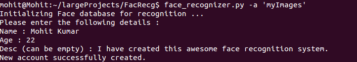
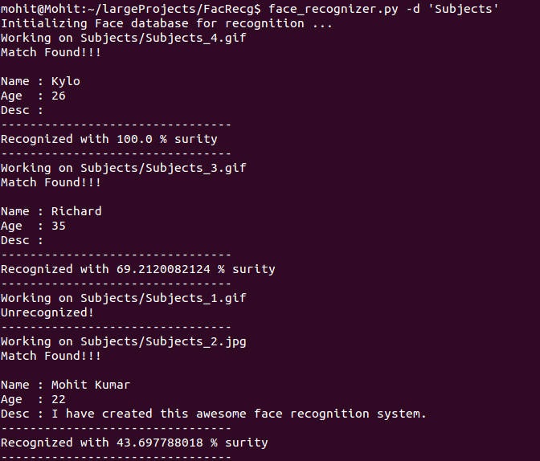

# face-recognition-system
Face Recognition system using OpenCV 2, Python 2.7 and Sqlite3.
Allows user to add account and run facial recognition on either a single file or a set of images in a directory.

Documentation
-------------

### Adding a new account
  Users can add an account in the database by specifying the directory name and related information to the person.  
  The command line syntax will be
  `face_recognizer -a <directoryname>`  
    
  An account will be created in **Sqlite3 database** and images from directory will be moved inside the **Images database.**

### Running face recognition on a single file
  Users can run facial recognition on a single image by specifying the complete pathname of the file.  
  The syntax will be
  `face_recognizer -f <complete filename>`  
    
  Image will go through face detection and then recognition, results will be displayed in terminal.
  
### Running face recognition on multiple files
  Users can specify the directory name containing multiple images.  
  Command line syntax
  `face_recognizer -d <directoryname>`
    